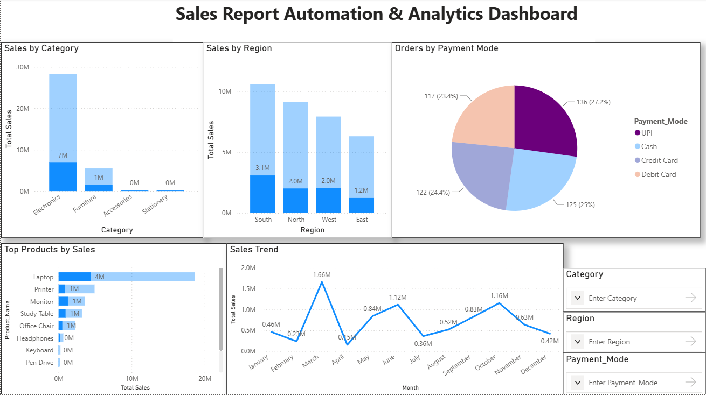

# 📊 Sales Report Automation & Analytics Dashboard

An end-to-end Data Analytics project built using **Python, MySQL, SQL, Excel, and Power BI**. The project demonstrates the complete analytics workflow from data generation to dashboard creation.

---

## 🚀 Features

- Generate realistic sales data using Python
- Store and manage data in MySQL
- Perform business analysis using SQL
- Build an interactive Power BI dashboard
- Analyze sales by category, region, product, and payment mode
- Interactive filtering using slicers

---

## 🛠️ Tech Stack

- Python
- MySQL
- SQL
- Microsoft Excel
- Power BI

---

## 📂 Project Structure

```
Sales-Report-Automation-Dashboard
│
├── Dataset
│   ├── sales_data.csv
│   ├── sales_data.xlsx
│   ├── generate_dataset.py
│   └── import_to_mysql.py
│
├── SQL
│   ├── create_database.sql
│   ├── create_tables.sql
│   └── queries.sql
│
├── PowerBI
│   └── SalesDashboard.pbix
│
├── Screenshots
│   └── dashboard.png
│
└── README.md
```

---

## 📈 Dashboard Features

- Sales by Category
- Sales by Region
- Orders by Payment Mode
- Top Products by Sales
- Monthly Sales Trend
- Interactive Filters (Category, Region, Payment Mode)

---

## 📸 Dashboard Preview



---

## 💡 Skills Demonstrated

- Data Analysis
- SQL Query Writing
- Database Management
- Data Visualization
- Business Intelligence
- Dashboard Development
- Reporting Automation

---

## 👨‍💻 Author

Sachin Gupta

LinkedIn: (https://www.linkedin.com/in/sachin-gupta-16651a24a/)

GitHub: (https://github.com/Sachingupta209)
